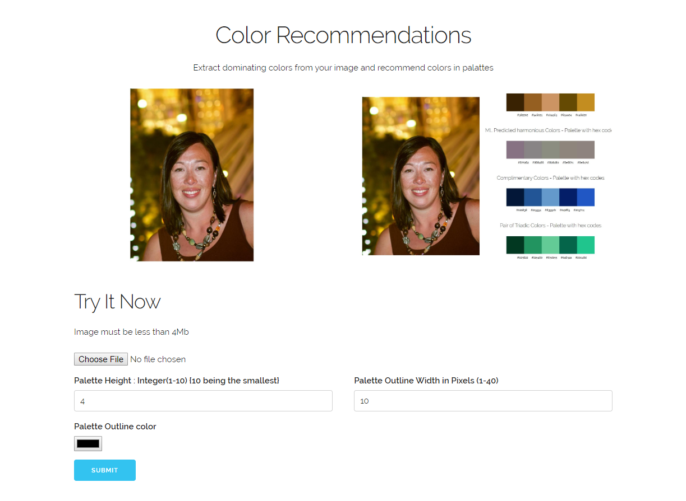
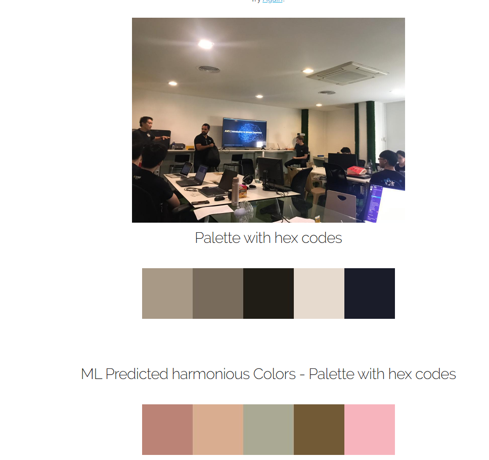
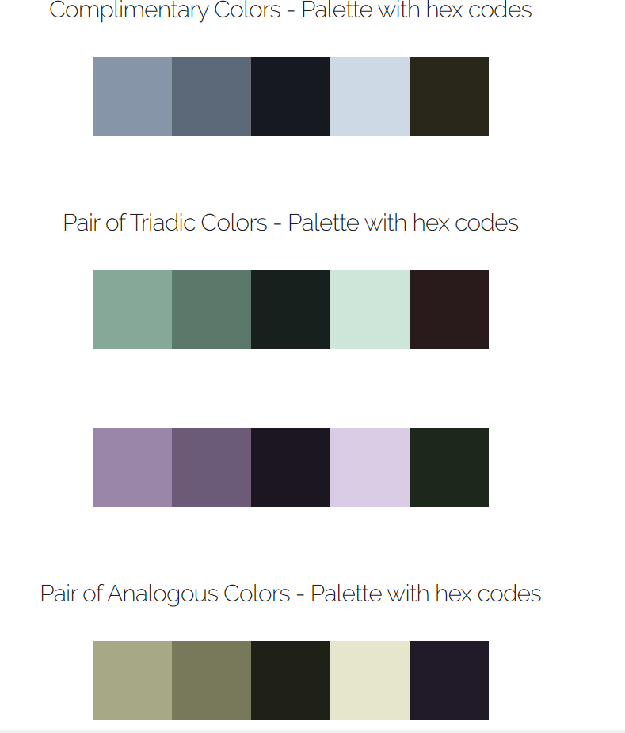

# color-palette-app
This is **forked** from **https://github.com/makkoncept/colorpalette**. Here I am using the Flask UI layout of the colorpalette repo and add in machine learning element. Instead of just extracting dominat color images from user's input image using kmeans, here we use colorgram.py module for extracting the 5 dominant colors from any user input images, in addition, we find colors recommendations by using 1) GAN model to predict the next 5 harmonious colors to be used together with the image's colors 2) Colors recommendations using rules from color wheel such as complimentary colors, Pair of Triadic Colors and etc.

### main page

### result from Machine learning (GAN)

### result from rules (color wheel)

## Install:

git clone https://github.com/brianmap72/color-palette-app.git 
cd color-palette-app

## Create a virtualenv:

python3 -m venv venv   

## Activate it on Linux:

. venv/bin/activate  

## Or on Windows cmd:

venv\Scripts\activate.bat  

## Install requirements:

pip install -r requirements.txt  

## Run:

python run.py

View on localhost:5000

## For Training the GAN model for color recommendation 

python palette_gan_training.py

## For testing the trained GAN model

python palette_gan_testing.py

** Take note the keras trained model (epoch_10.hdf5) is not provided in this repo
